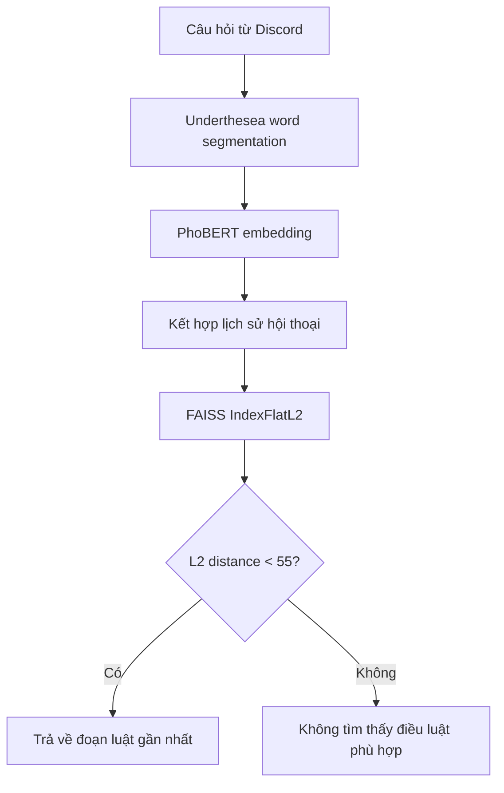
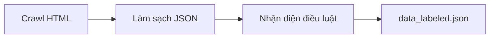

# Vietnamese Law Retrieval Chatbot

Chatbot hỏi đáp pháp luật Việt Nam chạy trên Discord, sử dụng **PhoBERT** để
biểu diễn câu hỏi và văn bản dưới dạng vector, sau đó dùng **FAISS** để tìm
đoạn luật gần nhất về mặt ngữ nghĩa.

Repository được xây dựng cho mục đích học tập và thử nghiệm các bước: thu
thập dữ liệu pháp luật, làm sạch văn bản, gán cấu trúc dữ liệu, tạo embedding,
semantic search và tích hợp mô hình vào Discord bot.

> **Lưu ý pháp lý:** Đây là sản phẩm thử nghiệm, không phải công cụ tư vấn
> pháp luật. Dữ liệu có thể thiếu, sai cấu trúc hoặc không còn cập nhật. Không
> sử dụng kết quả của chatbot làm căn cứ duy nhất cho quyết định pháp lý; hãy
> đối chiếu với văn bản chính thức hoặc người có chuyên môn.

## Phạm vi hiện tại

File [`data_labeled.json`](./Chatbot_law_discord/data_labeled.json) hiện chứa
**2.862 đoạn văn bản**, tập trung vào **Luật Đất đai**. Mỗi phần tử có dạng:

```json
{
  "label": "Tên hoặc nhãn của văn bản pháp luật",
  "text": "Nội dung chương, điều, khoản hoặc đoạn luật"
}
```

Trong dữ liệu đang được commit, trường `label` có cùng một giá trị cho toàn bộ
bản ghi. Vì vậy, hệ thống hiện phù hợp hơn với bài toán tìm đoạn liên quan
trong một văn bản luật, chưa phải tìm kiếm trên nhiều bộ luật hoặc phân loại
theo nhãn pháp lý.

## Kiến trúc hệ thống



Khi module `chatbot.py` được import, hệ thống:

1. Đọc toàn bộ `data_labeled.json`.
2. Tải tokenizer và model `vinai/phobert-base` từ Hugging Face.
3. Tách từ tiếng Việt bằng Underthesea.
4. Tạo embedding cho từng trường `text` bằng mean pooling trên hidden states
   của PhoBERT.
5. Đưa toàn bộ embedding vào `faiss.IndexFlatL2`.
6. Giữ tối đa ba embedding câu hỏi gần nhất trong lịch sử hội thoại.
7. Kết hợp embedding hiện tại với output của `ContextLSTM` theo hệ số
   `alpha = 0.2`.
8. Lấy một kết quả gần nhất từ FAISS.
9. Trả đoạn luật nếu L2 distance nhỏ hơn `55.0`.

Hệ thống hiện không gọi một generative LLM để viết câu trả lời mới. Nó trả về
nhãn và nội dung của đoạn luật được truy xuất. Vì vậy, cách gọi chính xác hơn
là **semantic retrieval chatbot**, không phải một RAG pipeline hoàn chỉnh có
bước generation.

## Thành phần chính

| Thành phần | Vai trò |
|---|---|
| [`bot.py`](./Chatbot_law_discord/bot.py) | Khởi tạo Discord bot và cung cấp lệnh `!law` |
| [`chatbot.py`](./Chatbot_law_discord/chatbot.py) | Tạo embedding, FAISS index và truy xuất đoạn luật |
| [`data_labeled.json`](./Chatbot_law_discord/data_labeled.json) | Dữ liệu Luật Đất đai đã xử lý |
| [`apicode.ipynb`](./Chatbot_law_discord/crawl%20and%20clean/apicode.ipynb) | Thu thập nội dung văn bản pháp luật từ trang web |
| [`clean_data.ipynb`](./Chatbot_law_discord/crawl%20and%20clean/clean_data.ipynb) | Chuẩn hóa khoảng trắng và một số dấu câu |
| [`labelcode.ipynb`](./Chatbot_law_discord/labelcode.ipynb) | Nhận diện tiêu đề điều bằng regex và tạo dữ liệu `label`–`text` |

## Công nghệ sử dụng

- [PhoBERT](https://huggingface.co/vinai/phobert-base): biểu diễn văn bản
  tiếng Việt.
- [Transformers](https://huggingface.co/docs/transformers/): tải tokenizer và
  pretrained model.
- [Underthesea](https://github.com/undertheseanlp/underthesea): tách từ tiếng
  Việt trước khi tokenize.
- [FAISS](https://github.com/facebookresearch/faiss): tìm kiếm vector gần
  nhất.
- [PyTorch](https://pytorch.org/): chạy PhoBERT và mô hình LSTM thử nghiệm.
- [discord.py](https://discordpy.readthedocs.io/): kết nối chatbot với
  Discord.

## Cài đặt

### 1. Clone repository

```bash
git clone https://github.com/taitv004/Vietname_law_chatbot.git
cd Vietname_law_chatbot/Chatbot_law_discord
```

Các script sử dụng đường dẫn tương đối đến `data_labeled.json`, do đó nên chạy
lệnh từ thư mục `Chatbot_law_discord`.

### 2. Tạo virtual environment

```bash
python3 -m venv .venv
source .venv/bin/activate
python -m pip install --upgrade pip
```

### 3. Cài dependency

```bash
pip install \
  torch \
  transformers \
  underthesea \
  faiss-cpu \
  numpy \
  discord.py \
  aiohttp
```

Lần chạy đầu tiên cần kết nối Internet để tải `vinai/phobert-base`. Quá trình
tạo embedding cho toàn bộ dữ liệu diễn ra ngay khi import `chatbot.py`, vì vậy
khởi động có thể mất thời gian tùy cấu hình máy.

## Cấu hình Discord bot

### 1. Tạo bot

Tạo application và bot trong
[Discord Developer Portal](https://discord.com/developers/applications), sau
đó:

1. Lấy bot token.
2. Bật **Message Content Intent** vì bot cần đọc nội dung câu lệnh.
3. Mời bot vào server với quyền đọc và gửi tin nhắn.

### 2. Cung cấp token

`bot.py` hiện import `TOKEN_BOT` từ `config.py`. Để chạy mà không sửa source,
tạo file `Chatbot_law_discord/config.py`:

```python
TOKEN_BOT = "YOUR_DISCORD_BOT_TOKEN"
```

Không commit file này. Thêm các mục sau vào `.gitignore` ở thư mục gốc:

```gitignore
.env
.venv/
__pycache__/
*.py[cod]
Chatbot_law_discord/config.py
```

Trong một phiên bản an toàn hơn, nên đọc token từ biến môi trường thay vì lưu
trong module Python:

```python
import os

TOKEN_BOT = os.environ["DISCORD_BOT_TOKEN"]
```

Sau đó cung cấp biến môi trường trước khi chạy bot:

```bash
export DISCORD_BOT_TOKEN="YOUR_DISCORD_BOT_TOKEN"
```

## Chạy chatbot

Từ thư mục `Chatbot_law_discord`:

```bash
python bot.py
```

Khi bot đã online, gửi lệnh trong Discord:

```text
!law <câu hỏi pháp luật>
```

Ví dụ:

```text
!law Luật Đất đai quy định như thế nào về người sử dụng đất?
```

Bot lấy đoạn gần nhất và gửi tối đa 2.000 ký tự để phù hợp giới hạn message
đang được xử lý trong code.

## Thử bộ truy xuất không cần Discord

Mở Python từ thư mục `Chatbot_law_discord`:

```bash
python
```

Sau đó gọi trực tiếp hàm truy xuất:

```python
from chatbot import get_law_answer

answer = get_law_answer(
    "Luật Đất đai quy định như thế nào về người sử dụng đất?"
)
print(answer)
```

## Chuẩn bị dữ liệu

Quy trình notebook hiện tại gồm ba giai đoạn:



### Crawl

Notebook `crawl and clean/apicode.ipynb`:

- gửi HTTP request tới trang văn bản trên `thuvienphapluat.vn`;
- lấy các thẻ `<p>` trong vùng nội dung chính;
- chuẩn hóa khoảng trắng và chuyển text thành chữ thường;
- lưu danh sách đoạn văn thành JSON.

URL và phạm vi đoạn cần lấy đang được cấu hình trực tiếp trong notebook. Hãy
kiểm tra điều khoản sử dụng của nguồn dữ liệu và tính hợp lệ của việc thu thập
trước khi crawl ở quy mô lớn.

### Làm sạch

Notebook `crawl and clean/clean_data.ipynb` duyệt các file JSON trong một thư
mục, loại bỏ một số dấu câu và khoảng trắng dư thừa, sau đó ghi đè dữ liệu đã
làm sạch.

### Tạo cấu trúc `label`–`text`

Notebook `labelcode.ipynb` dùng regex để nhận diện dòng bắt đầu bằng
`Điều <số>`, gom các dòng tiếp theo làm nội dung và ghi ra danh sách object
JSON. Các đường dẫn `INPUT_FOLDER` và `OUTPUT_FOLDER` hiện là placeholder,
cần sửa trước khi chạy.

## Các tham số truy xuất hiện tại

| Tham số | Giá trị | Ý nghĩa |
|---|---:|---|
| PhoBERT max length | `512` token | Giới hạn input cho mỗi đoạn/câu hỏi |
| Conversation history | `3` câu hỏi | Số embedding câu hỏi gần nhất được giữ |
| Context weight | `alpha = 0.2` | Trọng số output LSTM khi trộn embedding |
| FAISS index | `IndexFlatL2` | Tìm kiếm exact nearest neighbor bằng L2 |
| Top-k | `1` | Chỉ trả đoạn gần nhất |
| Distance threshold | `55.0` | Từ chối kết quả khi khoảng cách quá lớn |

Các giá trị `alpha` và threshold hiện được đặt thủ công, chưa được hiệu chỉnh
trên tập validation có nhãn.

## Giới hạn kỹ thuật hiện tại

Repository đang ở mức prototype và còn một số điểm quan trọng:

- `ContextLSTM` được khởi tạo ngẫu nhiên nhưng chưa được huấn luyện hoặc load
  checkpoint. Vì vậy, output LSTM chưa đại diện cho ngữ cảnh hội thoại đã học.
- `conversation_history` là biến global dùng chung; câu hỏi từ các user hoặc
  channel Discord khác nhau có thể bị trộn vào cùng lịch sử.
- PhoBERT chưa được gọi `model.eval()`, nên dropout có thể khiến embedding
  thay đổi giữa các lần chạy dù đang dùng `torch.no_grad()`.
- Mean pooling chưa sử dụng attention mask để loại token padding.
- Embedding của toàn bộ dữ liệu được tính lại mỗi lần bot khởi động và chưa
  được cache xuống ổ đĩa.
- FAISS dùng raw embedding, chưa normalize và chưa so sánh với cosine
  similarity.
- Hệ thống chỉ lấy top-1 và threshold `55.0` chưa được đánh giá định lượng.
- Dữ liệu hiện chỉ tập trung vào Luật Đất đai và chưa có version/date rõ ràng
  để kiểm tra độ cập nhật.
- Bot trả nguyên văn kết quả truy xuất; chưa có LLM generation, reranking,
  citation validation hoặc cơ chế kiểm chứng.
- Tác vụ embedding/search chạy đồng bộ bên trong Discord command và có thể
  chặn event loop khi tải cao.
- Response dài bị cắt tại 2.000 ký tự thay vì chia thành nhiều message.
- Kết nối aiohttp trong `bot.py` đang tắt SSL verification; không nên duy trì
  cấu hình này trong môi trường thật.
- Repository chưa có `requirements.txt`, test tự động, logging hoặc xử lý lỗi
  đầy đủ.

## Hướng phát triển

- Chuẩn hóa lại dữ liệu theo `law`, `chapter`, `article`, `clause`, `text`,
  `source_url` và `effective_date`.
- Dùng nguồn văn bản chính thức và lưu version của từng văn bản.
- Đặt PhoBERT ở evaluation mode và thực hiện masked mean pooling.
- Cache embedding và FAISS index để giảm thời gian khởi động.
- Loại bỏ LSTM chưa huấn luyện hoặc xây dựng dữ liệu để huấn luyện mô hình
  hội thoại đúng mục tiêu.
- Tách history theo `guild_id`, `channel_id` và `user_id`.
- Trả nhiều candidate, bổ sung reranker và hiển thị nguồn/điều/khoản.
- Xây dựng tập query–relevant passage để chọn threshold và đo Recall@k, MRR.
- Chuyển phần retrieval sang worker/thread riêng để không chặn Discord bot.
- Bổ sung generative LLM nếu muốn phát triển thành RAG, đồng thời bắt buộc câu
  trả lời trích dẫn đúng đoạn luật được truy xuất.

## Bảo mật

- Không commit Discord token, API key, cookie hoặc credential.
- Không commit `config.py`, `.env`, `__pycache__` hoặc file `.pyc`.
- Nếu một token từng xuất hiện trong repository công khai, hãy revoke và tạo
  token mới; chỉ xóa file khỏi commit mới không làm token biến mất khỏi lịch
  sử Git.
- Không tắt SSL verification trong môi trường production.
